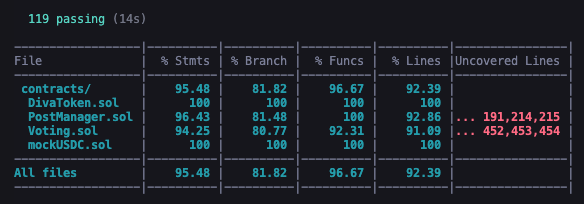

# DIVA

Le Projet DIVA est une plateforme décentralisée (dApp) qui factcheck les contenus web (images, vidéos, etc.) postés par les utilisateurs, en laissant la parole aux utilisateurs.

## Backend

Les smarts contracts ont été déployé sur le testnet Amoy de Polygon:

mockUSDC.sol : https://amoy.polygonscan.com/token/0x7462dF5399f764d144670929520Cc7E14797f877

Voting.sol et les deux instances de contrats qu'il génère DivaToken.sol et PostManager.sol:

https://amoy.polygonscan.com/address/0xdcE969C609392f190ecD10B2e6E0e37206e426c2#internaltx

## Vidéo du workflow

https://www.loom.com/share/e0eb91d38d4c49a78b05ba2571e7bedd

## Testing coverage

